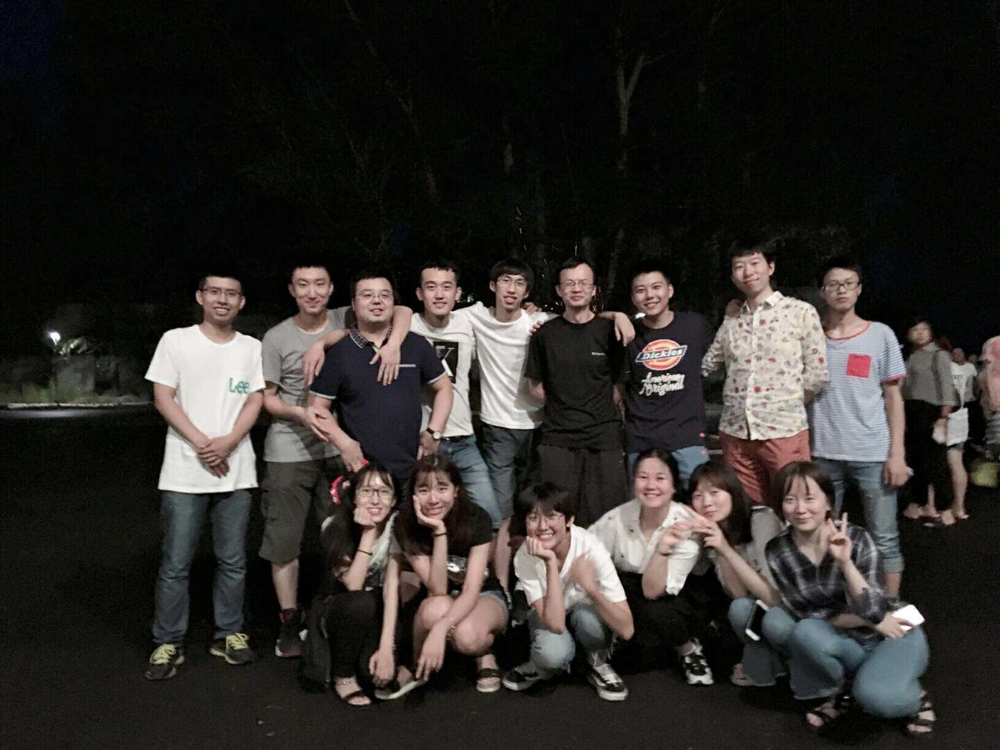
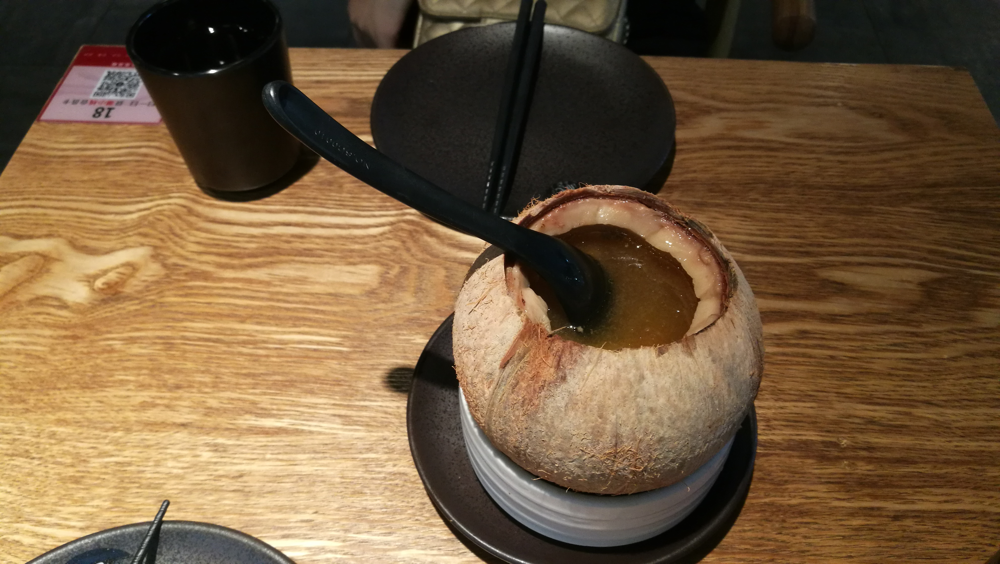
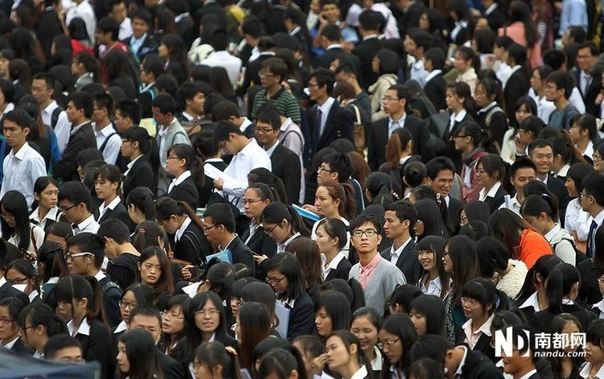
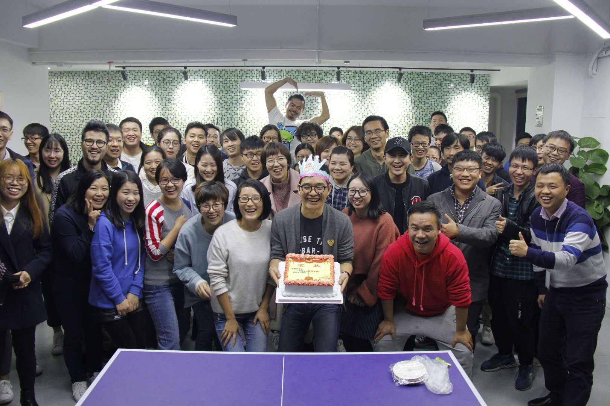
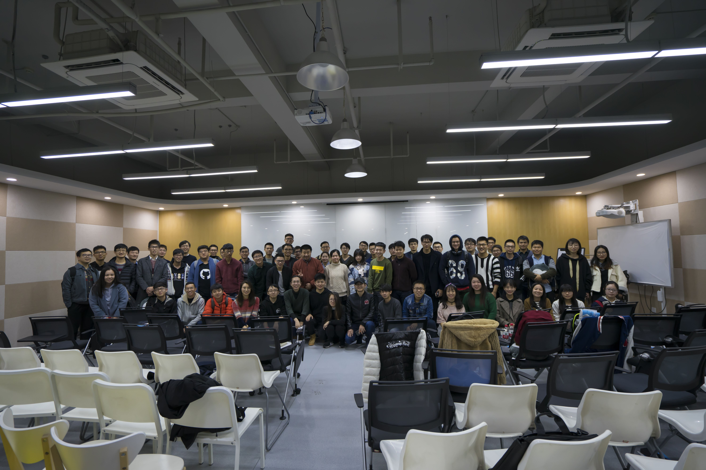
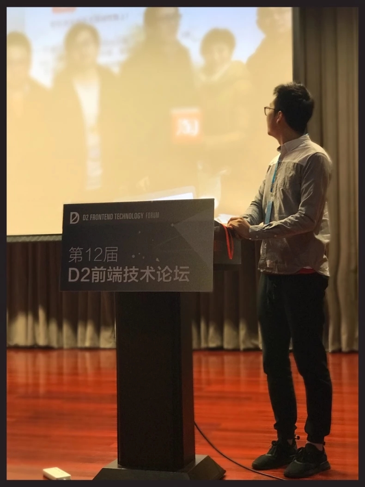

现在是 `2018年1月1日11:59`, 刚过去2017年11小时59分钟, 吃完午饭和室友走着蹦出了一句: 新年第一天, 难道就窝在寝室一天? 恍然大悟, 决定留下点什么, 由于明天有考试, 也不能出去浪了, 就想总结一下自己 `2017年` , 顺便对 `2018年` 做一个规划、展望. 

## **2017**的总结

在过去的这一年里, 有许多颇为重要的经历. 经过了人生中的十字路口, 做出了人生中又一个选择, 完成了从学生时代到社会青年的蜕变..., 大四了, 许多事, 许多选择, 许多坎需要我去经历, 去把握. 

一. 春招. 春招实习, 进入了我人生中的第一家公司: `安天科技` , 在公司学到了一些可视化的东西, 不幸的是我对它不感兴趣, 不过私下学习的时候接触到了 `VUE` , 对这个框架倒是比较上心的, 于是用它来写了点东西, 还可以, 第一家公司, 怎么说呢, 同时都挺好的, 导师也是尽心帮我解决一个又一个的问题, 只怪自己沉不住气, 下不去心, 并没有学到太多, 学的也只是自己私下来学的一点东西. `8月` , 辞职回家.

二. 深圳. 8月中下旬去了趟深圳, 之前打算去深圳考察一下, 毕业想去的, 不过玩了几天, 这个想法就不攻自破了, 消费太高, 房价太贵, 没戏.

三. 秋招. `9月` 来到学校就开始了秋招, 第一个面试的也是现在就职的公司, 之前了解到这家公司是公司的前端老大, 慕课网上录了很多视频, 质量也很高, 而且看过它写的自己的经历, 蛮励志的. 之后还面过 阿里, smartx, rokid, 滴滴, 去哪儿网..., 最后还是去了那家公司, 创业公司, 一切都是未知数, 但是同时也是个机会.

四. 入职. 入职后不久就经历了个人人生中的第一个项目, 虽然在项目中只负责了一个小的模块的编辑, 但是从一开始的 `UI评审` , 到 `终审` , 到 `接口对接`, 再到 `开发` 、 `联调` , 最后的 `测试上线` 我都一一参与了, 熟悉了项目开发的一系列流程, 熟悉项目开发流程的同时, 也熟悉了 `React Native` , 之后, 陆续接入了其他项目的开发, 这一路走来, 虽然有压力, 有痘痘, 有熬夜, 但更多的是项目上线后的快乐, 在技术分享中的幸福, 因为 `Coding` 本身就很快乐😢.

老大说的没错, 可以想象接下来该怎么过(虽然想也什么卵用, 可能压根就不想明白), 但是养成总结和规划的习惯, 会加速你的成长. 一年说长不长, 说短不短, 但是总结下来就上面几条而已, 这样看来清晰明了. 过去的一年有所成长, 但是更多的需要我继续去努力, 去掌控, 更多的缺点, 坏习惯需要我去改正， 更多的困难需要我去克服.

对了, 忘了两个, 今年还参加了 `nodeParty` 和 `D2` 两次技术交流会, 很好, 也学到了很多, 对于前端之路了清晰很多, 补两张图.

## **2018**的展望

一年之计在于春, 希望在新的一年里有一个好的开始.

技术方面:

 1. 技术上能够有所沉淀, 业务做好的同时还可以学点其他的东西, 如 `node`, `VUE`, `React`, `Angular`...

 2. 做一些 `PC端` 的布局等等, 总写 `RN` 感觉布局方面忘记了很多

其实说的有些宽泛, 太宽泛并不好, 可能有时候就不知道该干些什么了, 精细一下就是每一年都要有所成长, 要有所收获, 从 `RN` 出发, 重心还是移动端, 结合 `React` 写一些 `PC端` 的页面, 深入了解其原理, 学会总结. 其他时间学学 `node` 等等就可以了.

生活方面:

 1. 希望家人们都身体健康!

 2. 快毕业了, 买房买车存款...也该提上日程了, 所以, 新的一年, 希望能够存点钱(最好多存点).