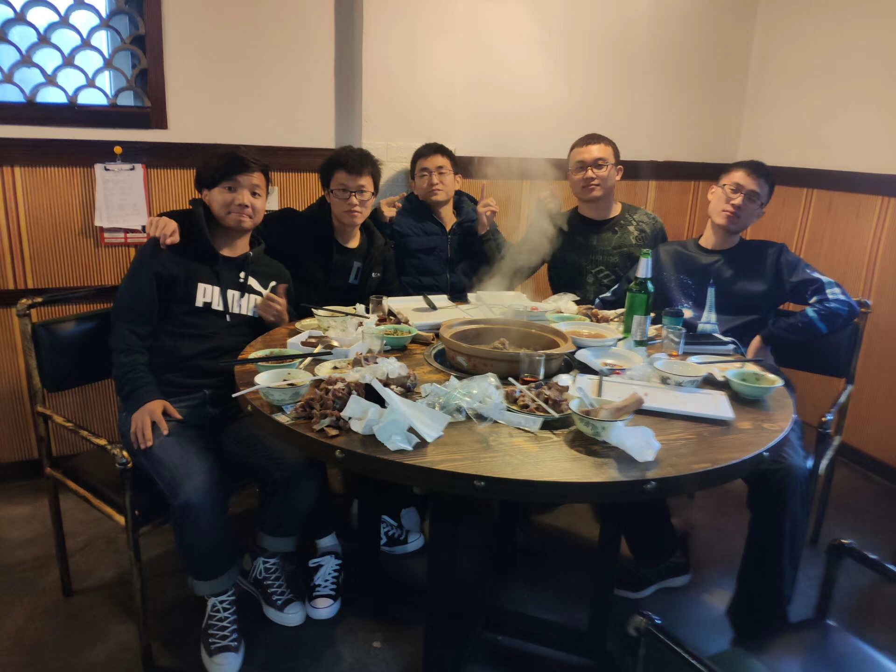

## 2018 年终总结

> 又是一年元旦时，是时候该对过去的 **2018** 年做一个总结了。在过去的这一年中，收获了许多，也成熟了许多，不得不说，学校与社会还是有很大的差距，即便是仅毕业半年，思想与心灵都有太多的改变，我将其分为四块，**工作篇**，**生活篇**，**不足篇**、**展望篇**。

---

#### 一、工作

    毕业之后不久师傅逐渐让我承担了更多的工作量和更多的任务，慢慢的我也大体上能够 hold 住，但有些时候很怀疑我是否适合这个行业，能够完成任务，但只能说是差强人意，总是哪里缺一点东西，不过项目一个接一个的冲击，再加上师傅今年老过来教我业务知识，还是有一些收获，自己会考虑如何去思考页面实现的最佳方式，如何提高用户体验等等，希望师傅以后可以老来教我，我老喜欢了。十月顺利转正，也结束了实习生涯，再也不用胆战心惊的工作了，今年由于思想的变化，重生活轻工作，导致工作方面就有些忽视了，接下来的一年得调整一下方针策略，毕竟工作的更好，生活才可能更好。团队方面，在 Scott 的带领下，今年团队人数又上升了，团队分工也愈来愈明确，各司其职，且首次出现了前端架构组，总之就是一切都在向着好的方向发展，唯一不好的是聚餐桌子越来越不好找了，毕竟人多。

#### 二、生活

    这就有的说了，因为这一整年变化最大的应该是生活方面，变化之初是 6 月初毕业之后来再回公司的时候，发现自己沉迷业务无法自拔，久而久之会觉得无聊，除开公司的事情就没有其他的业余爱好，用一个词形容叫 无趣，工作不止于眼前的苟且，还有生活与远方，于是开始学着改变，先是关注 AB 站上面一些 up 主，没事看看动漫，美食，电影什么的，我这提一下电影的收获，就是文艺，能够客观的评价电影，而且能够跟着 up 主去剖析电影。接着又买了个吉他学，大学时就学过一阵后荒废了，现在重新提起来，现在扫弦还差点火候，预计一年后就可以演奏了，10 月开始负担妹妹的生活费，主要是自己手抖，每月发工资都很难存下来钱，所以接着买了锅碗瓢盆开始自己做饭，凭借 美食 up 主的视频，腰包没鼓起来，厨艺到是日渐精进。社交方面，就有时候周末还会约一些同事做做饭聊聊天，或者一起去西湖转转，还参加了一次 18 公里的徒步。之后看到一些同事（大佬）平时一起吃饭的时候总拿着 Kindle 看书，就萌生了看书的想法，开始定的每周一本，没坚持下来，大概 5，6 本，全是文学类小说、杂文。余华的《活着》、《许三观卖血记》，萧红的《呼兰河传》等等，通过看书，学到的就是思考，为人、说话、做事都需要思考，目前还不能达到掌控与平实的谈吐，不过我今年包括以后会看更多的书，提高自身修养。记不清什么时候朋友推荐了一部美剧 《越狱》，又迷上了美剧，同事和朋友之后又陆续的推荐了好几部，我就一部一部的看完，看美剧的原因主要是培养语感，还有外国人文化，生活，虽然确实这些都有一定的收获，可不幸的是，我学到的更多的是骂人的话，好几种（挠头），不过不管怎样我会接着看下去，说不定哪天碰到外国佬问我路的时候我会像 Jack Ma 那样地道的英语去回答。双十一前后朋友来我这里玩，看他的穿搭再看我的， low 爆，意识到已身于社会穿衣搭配也是必不可少的，之后就一直请教他穿搭方面的知识，也开始大胆的尝试各种风格的衣服，甚至是喷香水，现在，我个人感觉自己处在人群中没那么 low 了，18年最后一件事就和建成老表一起上海跨年，这个本不该写出来的，但因为此次上海行也有一定收获，就带上了，去上海看了东方明珠，陆金所，外滩，商业街..，魔都是真的繁华，街上形形色色的人跟在美剧里面看到的有几分相像，高楼大厦，是一楼都有十多二十米的那种，捧着星巴克，三俩朋友闲聊，正如阿甘 mom 说的：人生就像一盒巧克力，你永远都不知道下一个会拿到什么味道的，有钱真的可以为所欲为。其次就是明白了朋友圈的很多朋友为什么总喜欢去国外旅游的原因了，真的是太多人了...

#### 三、不足

    当然， 2019 年亦是未来也有需要改善的地方。从小到大的缺点，马虎，缺乏严谨，这主要体现在细节方面处理的不好。性急，可以说成是控制不好自己的情绪，有时候与产品、运营碰需求，碰着碰着就成了争论，这可能要与师傅多学习学习了，笑着撕逼，最为致命！该嬉皮笑脸时随便吹，该强硬时决不退步。沟通能力有提升，但还是不足，我想了一下应该是沟通技巧，碰到同事、朋友聊什么话题，谈什么东西，需要一套完备的模式，也就是套路，看过《人性的弱点》，但里面说的方向有些大，可能要其他类似的书补补。另外，酒桌文化，再次之前我习得的是与亲人与朋友的酒桌文化，步入社会，已不再适合了，需要学习适应于同事与普通朋友的文化，很重要！

#### 四、展望

    让接下来一年的工作篇像去年的生活篇那么多感受与收获，不足篇肯定得越来越少，看更多的书，更多的美剧，另外，大学时辅导员常对我们说过一句话：身体与学习至少要一个在路上。在过去的 2018年里，我极少运动，出汗就更加少了，因此在 2019 年里，将健身提上日程，锻炼身体也相当于投资自己，总之一句话，在保证质量的情况下要尽可能快的成长！最后，Happy New Year ！新年快乐！！！末尾是 2018 年里部分照片，展示一下。
   

记于2019年1月1日从上海回杭的火车上.

